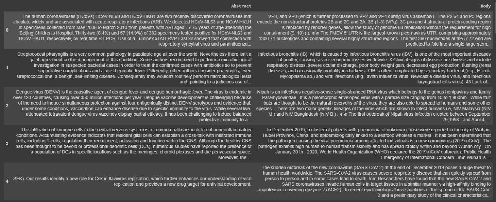
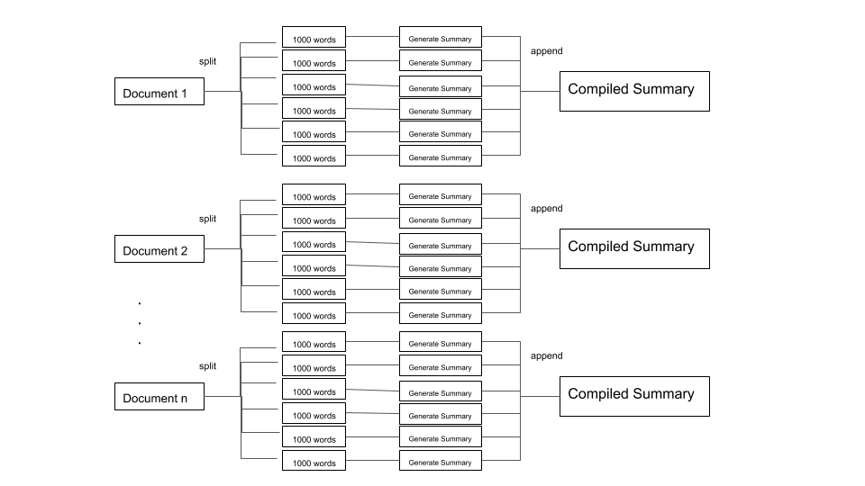
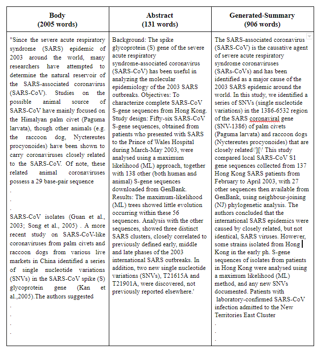
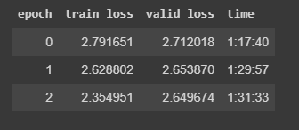

This repo is currently on the work and not finished yet

  

                                        

<h2 align="center">Project Name: Text Summarization on COVID-19 Articles</h2>
<h2 align ="center">Course Number: CSE 465 
Course Name: Pattern Recognition
Section:2 
Semester: Spring 2020  
Faculty Name: Dr. Nabeel Mohammed</h3>

Group Members:

<ul>
<li>Sayeed Md. Shaiban</li>
<li>Abdullah Md. Sarwar</li>
<li>Arshi Siddiqui Promiti</li>
</ul>

 

Abstract—Summarization  has  long  been  a  significant  area  of concern in the field of Natural Language Processing, mostly due to  the  its  dependency  on  human  intervention.  In  this  study,  we use  a  denoising  autoencoder,  BART,  to  carry  out  abstractive summarization on the dataset of COVID-19, using ROUGE scores as an evaluation metric. The primary focus of the study has been the  use  of  medical  articles  based  on  COVID-19,  which  is  aimed to provide a significant support for the research purpose during the  pandemic.

Dataset— The dataset used is from the "COVID-19 Open Research Dataset Challenge (CORD-19)". The COVID-19 Open Research Dataset (CORD-19) is provided by the White House through a coalition of leading research groups. CORD-19 is a resource of over 140,000 scholarly articles, including over 65,000 full text about COVID-19, SARS-CoV-2, and related coronaviruses.The dataset in its raw form was a collection from json files. We pre-processed the data and collected only the relevant parts,e.g. Abstract and Body text. 
  

CORD-19 Dataset after pre-processing: 

	

Inference Architecture:

  

  

Example of the Input text (Body), Target (Abstract) and machine generated summary:  

  

 

Training and Validation loss values for 3 epochs with a learning rate of 3e-5: 

	

